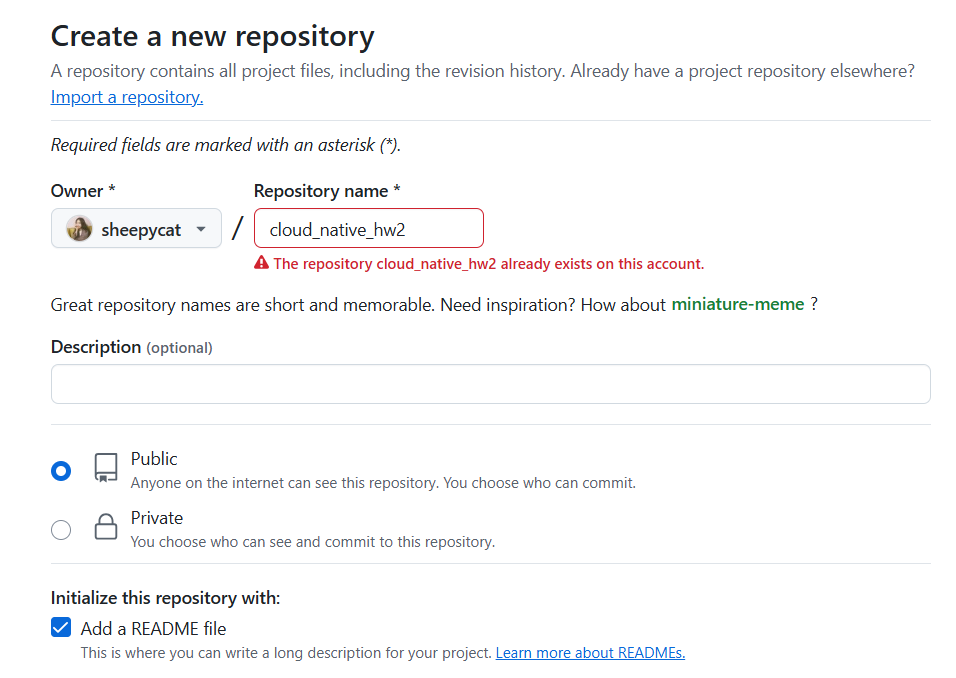
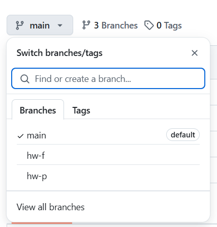
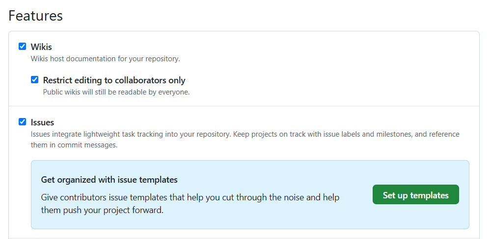
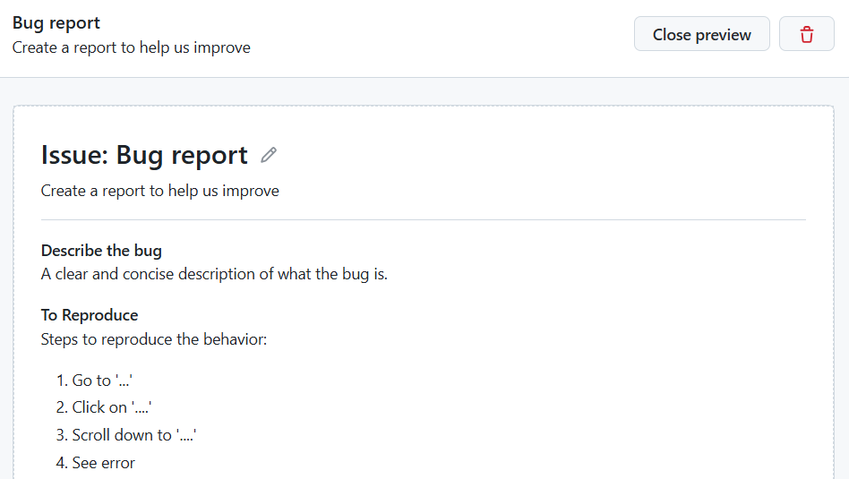
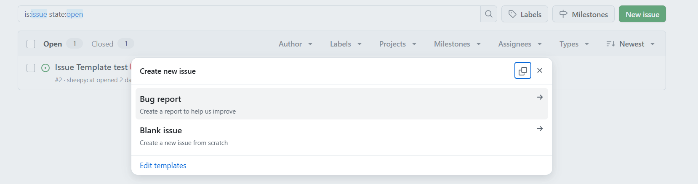
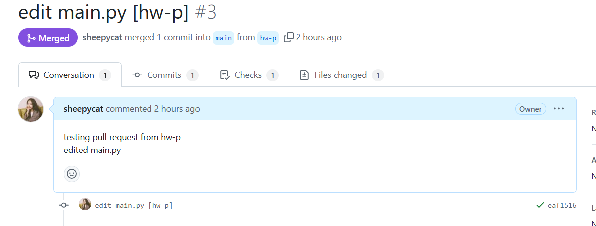
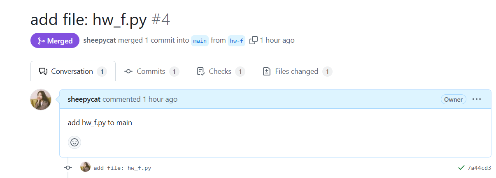
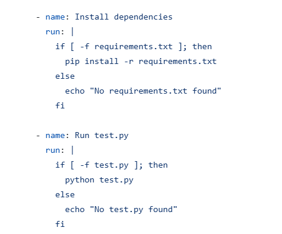
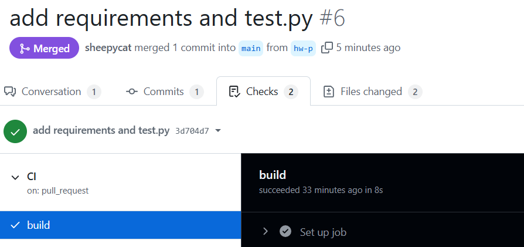
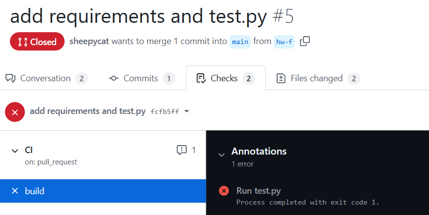

# cloud_native_hw2
2025 spring - cloud native - assignment 2

Repo link: https://github.com/sheepycat/cloud_native_hw2.git

### Part 1. Repo 操作
---

* 創建新 Repo，設定 repo name、權限 (public)、新增 README.md

* 創建 hw-f, hw-p 兩個 branch

### Part 2. Issue
---

* 從 Repo settings 的 Features 新增 issue template

### Part 3&4 Pull Request & GitHub Action
---
* hw-p, hw-f 的 pull request 和 comment:

* Github action: 使用 template: simple workflow，再額外加入兩個步驟: 使用 requirements.txt install dependencies、 run test.py

* hw-p, hw-f PR 的 Github Action 運行結果。其中 hw-f 的 test.py 有 bug，使 Github Action 運行失敗

